# Attention Is All You Need—注解

### 一、模型结构

模型的overview如下：

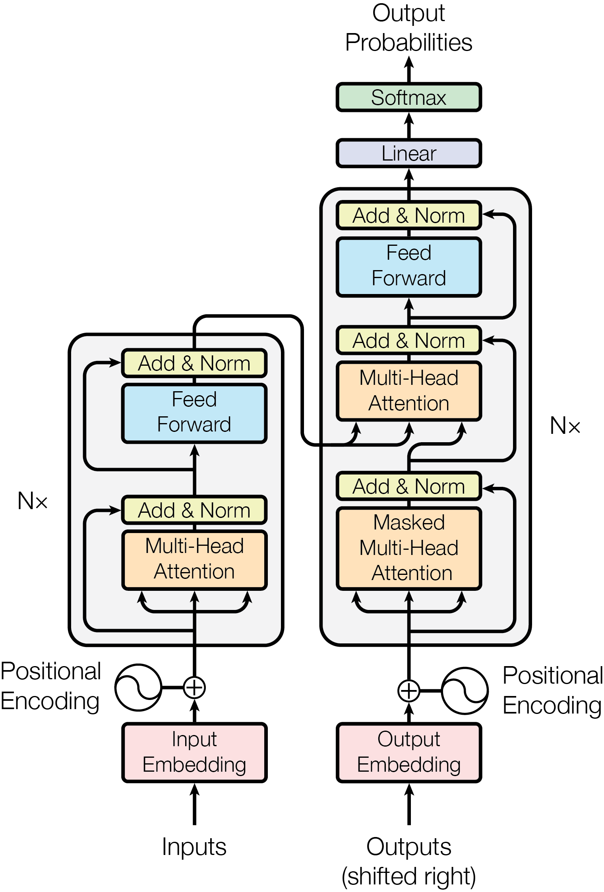

大部分用于序列转换(sequence transduction)的模型通常都由一个编码器(Encoder)和一个解码器(Decoder)组成，Transformer也遵从了这种设计。简单来讲，编码器可以将符号表示的输入序列$\mathbf x=(x_1,\cdots,x_n)$映射为表征(representation)序列$\mathbf z=(z_1,\cdots,z_n)$。当给定了表征序列后，解码器可以可以生成符号输出序列$\mathbf y=(y_1,\cdots,y_m)$，其中每个时刻解码器可以生成一个字符$y_i$，并且其总是自回归的，使用先前生成的符号作为额外输入。


#### 1、编码器

下图所示即为Transformer的编码器的一层(layer)，整个编码器是由$N$层(stack)堆叠而成的。

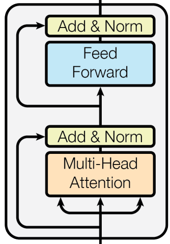

在编码器的每个层中，包含两个子层(sub-layer)，首先是一个多头自注意力(Multi-head self-attention)层，然后是一个简单的、位置上完全连接的前馈神经网络(FNN)层。可以看见每个子层都引入了残差连接，正如侧边由输入直接导向输出的箭头所示。每层的最后都会进行一次层归一化。

*注：各种归一化的比较如下图所示。*

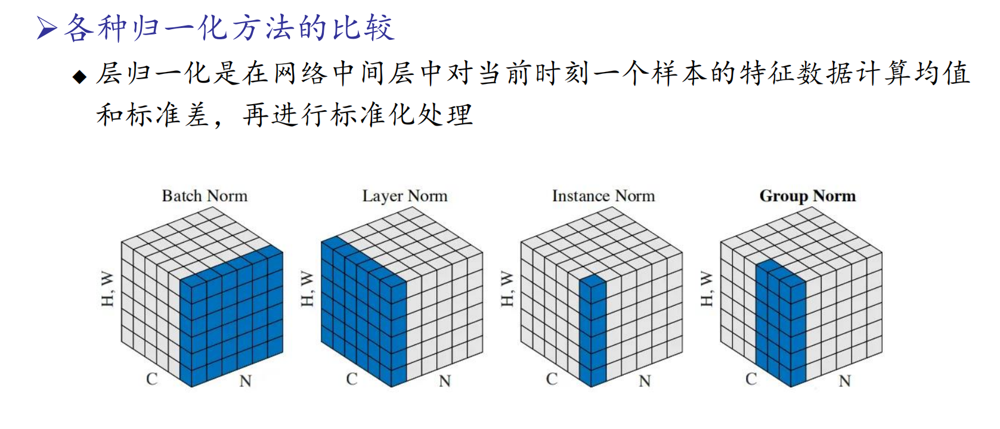

在Transformer编码器和解码器的每一个子层（sub-layer）最后引入层归一化（Layer Normalization）有以下几个好处：

1. **稳定训练过程**：层归一化通过标准化每一层的输入，减少了梯度爆炸和梯度消失问题，从而使得训练过程更加稳定和高效。
2. **加速收敛**：层归一化可以使模型的收敛速度加快，因为它能够确保每一层的输入分布更加一致，减少了模型训练中由于不同层输入分布变化带来的不稳定。
3. **提高模型性能**：通过标准化每一层的输入，层归一化有助于提高模型的整体性能，使其在训练集和测试集上的表现更加一致，避免过拟合或欠拟合。
4. **减少超参数调节**：层归一化使得模型对不同超参数（如学习率）的选择不那么敏感，从而减少了调节超参数的复杂度。
5. **更好的梯度传播**：在深层网络中，梯度传播往往会变得困难。层归一化可以在一定程度上缓解这个问题，使得梯度在反向传播过程中能够更有效地传递。

因此，编码器中每个子层的数学表示式可以写为：
$$
\text{Sub-layer Output}=\text{LayerNorm}(x+\text{Sublayer}(x))
$$
其中$\text{Sublayer}(x)$可以是多头自注意力计算，也可以是FNN计算。

在编码器中，为了规范向量维度进行残差连接等，模型中的所有子层和嵌入层(Embedding Layers)的输出维度都规范为$d_{model}$


具体的代码实现中，一层(Layer)的网络结构定义如下：

```python
class TransformerLayer(nn.Module):
    def __init__(self, embed_dim, num_head, feedforward_dim, dropout, no_res):
        super().__init__()
        self.norm1 = nn.LayerNorm(embed_dim)
        self.attn = SelfAttention(embed_dim, num_head, dropout)
        self.norm2 = nn.LayerNorm(embed_dim)
        self.ffn = FFN(embed_dim, feedforward_dim, dropout)
        self.no_res = no_res # whether to use residual connection

    def forward(self, x):
        # normalize the input via `self.norm1()`: x_norm = LayerNorm(x)
        x_norm = self.norm1(x)
        # calculate the output of multi-head self-attention
        x_attn, attn = self.attn(x_norm)

        if self.no_res is False:
            x_attn = x_attn+x

        # calculate the output of feed forward network 
        x_ffn = self.ffn(self.norm2(x_attn))

        if self.no_res:
            out = x_ffn
        else:
            out = x_ffn+x_attn

        return out, attn
```


#### 2、解码器

下图所示即为Transformer的解码器的一层(layer)，整个编码器是由$N$层(stack)堆叠而成的。

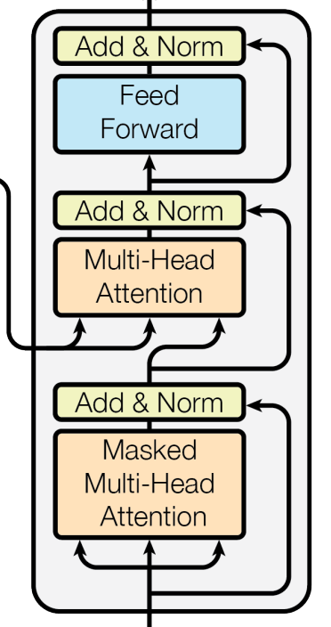

与编码器类似，在解码器的每个层中，包含三个子层(sub-layer)，除了前面提到过的多头自注意力层和FNN层外，还有一个多头注意力层，其输入是编码器的输出与上一个子层的输出（参见中间的子层，左边延伸过来的箭头便是编码器的输出）。可以看见每个子层都引入了残差连接，正如侧边由输入直接导向输出的箭头所示。每层的最后都会进行一次层归一化(Layer normalization)。

值得注意的是，编码器的第一个子层是一个带掩码的多头注意力层，这可以保证解码器只能看到当前时刻以前的信息，确保它是自回归(auto-agressive)的。该子层的输入是模型的输出经过Embedding与位置编码后的向量。

*注：Transformer的编码器和解码器有N层，每层都遵循这样的结构。*

==问：编码器和解码器对应的Layer之间进行连接吗？所以一共有N个编解码器之间的连接吗？==


#### 3、注意力机制

注意力机制的函数可以将查询(query)和键值对(key-value pairs)映射成输出向量。

##### （1）缩放点积注意力(Scaled Dot-Product Attention)—每个头的计算规则

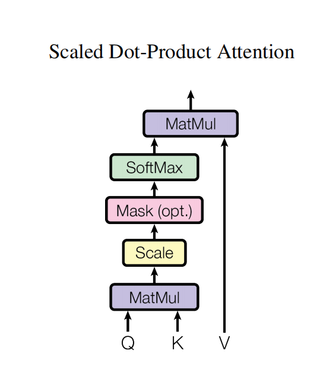

如图所示，输入Q(query)与K(key)的维度为$d_k$，输入V(values)的维度为$d_v$，注意力的计算公式如下：
$$
\text{Attention}(Q,K,V)=\text{softmax}(\frac{QK^T}{\sqrt{d_k}})V
$$
在这里，QKV为矩阵，这是Transformer优异的可并行计算性质的体现，我们可以同时对大量的qkv进行计算，因此可以将他们并列为一个矩阵同时运算。

注意到softmax内部除了一个$\sqrt{d_k}$因子，这是因为在$d_k$较大时，矩阵乘积也会很大，会带来负面的效应，因此要进行缩放。根据softmax函数公式：
$$
\text{softmax}(x_i)=\frac{e^{x_i}}{\sum_j e^{x_j}}
$$
如果输入值（即点积得分）非常大，那么在计算指数项时也会非常大导致一个数值远远大于其他数值，从而使得软最大函数的梯度变得非常小，接近于零。这会影响梯度下降算法的有效性，使模型训练变得困难。通过对点积进行缩放，可以确保点积得分的分布更均匀，避免极端值。这样，软最大函数可以更有效地分配权重，模型的训练过程也变得更加稳定。


注：在这里的运算中，各个矩阵的尺寸为
$$
Q:B×L×d_k\\K:B×L×d_k\\V:B×L×d_v\\ \text{Attention Output}:B×L×d_v
$$


##### （2）多头注意力(Multi-head Attention)

如果将QKV一次性输入一个缩放点积注意力中进行运算，可能会由于平均注意力加权而降低模型的分辨率性能。在这里采用了多头注意力，可以从很多方面提升模型的性能。多头注意力的运算结构如下：

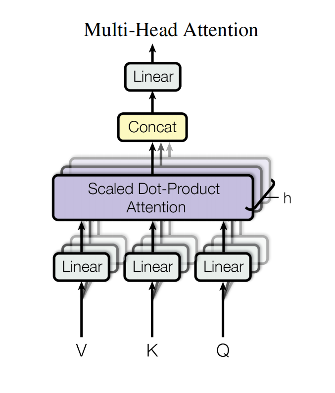

其计算数学表达式如下：
$$
\text{MultiHead}(Q,K,V)=\text{Concat}(\text{head}_1,\cdots,\text{head}_h)W^O\\
\text{h}_i=\text{Attention}(QW^Q_i,KW^K_i,VW^V_i)
$$
这里的各个W矩阵是<u>可学习</u>的线性投影矩阵，能将QKV映射到不同的空间上进行注意力运算，学习到更丰富的表示。h是头数。

各个矩阵的尺寸为：
$$
Q:B×L×d_{model}\\K:B×L×d_{model}\\V:B×L×d_{model}\\W_i^Q:d_{model}×d_k\\W_i^K:d_{model}×d_k\\W_i^V:d_{model}×d_v\\h_i:B×L×d_v\\\text{Concat Output: }B×L×hd_v\\W^O:hd_v×d_{model}\\\text{MultiHead Output:}B×L×d_{model}
$$
（注意这里的QKV和上面的不同，这里的QKV是更原始一些的数据，处理后的尺寸与上面的QKV相同）

根据结果可以发现，多头注意力输出的结果和输入的KQV(当L不同时尤其是Q)相同。


重点注意：QKV实际上是对同一个输入X通过不同的线性层映射得到的


#### 4、全连接前馈神经网络

全连接前馈神经网络(FFN)由一个ReLU激活函数和两个线性变换层组成，表达式如下所示：
$$
\text{FFN}(x)=\text{max}(0,xW_1+b_1)W_2+b_2
$$
尽管线性变换在不同位置上的操作是相同的，但是模型在不同的层(layer)中使用了不同的线性层参数，可以有如下好处：

1. **捕捉不同层次的特征**

   每一层的线性变换使用不同的参数，这允许每一层能够学习和捕捉输入数据的不同特征和模式。低层次的层可能学习到一些基本的模式或局部特征，而更高层次的层则可以组合这些低层特征来学习更抽象、更全局的表示。这种层次化的特征学习方式是深度神经网络的核心优势之一。

2. **增强模型的表达能力**

   使用不同层的参数增加了模型的表达能力。每一层都有自己的权重矩阵，这意味着每一层可以独立地调整和优化其输入的表示方式，从而使得整个模型具有更强的灵活性和适应性，可以处理复杂的输入数据。

3. **防止信息瓶颈**

   如果所有层使用相同的线性变换参数，那么模型在不同层次上所能捕捉到的信息会受到极大限制，可能会形成信息瓶颈，限制模型的性能。不同层使用不同的参数，可以确保每一层都有机会独立地学习和表示输入数据的多样性。

4. **提高训练效果**

   不同层使用不同的参数，可以提高模型的训练效果。不同层的参数可以根据各自的需求进行调整，从而优化整个模型的性能。反之，如果所有层共享参数，可能会导致训练过程中的冲突和不稳定。

5. **支持多头注意力机制**

   在Transformer中，尤其是在多头注意力机制中，不同头的线性变换参数允许每个注意力头关注输入数据的不同部分和不同方面。这样可以让模型在同一层中并行地捕捉到多种不同的特征和关系，进一步增强了模型的能力和表现。


前馈神经网络(FFN)的矩阵维度为$d_{ff}$.


在具体的代码实现中，前馈神经网络定义如下：

```python
class FFN(nn.Module):
    def __init__(self, embed_dim, feedforward_dim, dropout):
        super().__init__()
        self.fc1 = nn.Linear(embed_dim, feedforward_dim)
        self.fc2 = nn.Linear(feedforward_dim, embed_dim)
        self.drop = nn.Dropout(dropout)

    def forward(self, x):
        x = self.fc1(x)
        x = gelu(x)
        x = self.fc2(x)
        x = self.drop(x)
        return x

    
def gelu(z):
    """
    Reference: Gaussian Error Linear Units (GELU) paper: https://arxiv.org/abs/1606.08415
    0.5z(1 + tanh[(2/π)^(1/2) * (z + 0.044715 z^3)])
    """
    return 0.5 * z * (1.0 + torch.tanh(math.sqrt(2.0 / math.pi) * (z + 0.044715 * torch.pow(z, 3.0))))
```

ReLU（Rectified Linear Unit）和GELU（Gaussian Error Linear Unit）是深度学习中常用的两种激活函数。ReLU 和 GELU 各有优缺点：ReLU 计算简单且在许多任务中表现良好，但在处理复杂输入分布时可能不如 GELU。GELU 更平滑，适合用于需要处理复杂分布的深度学习任务，但计算复杂度较高。


#### 5、嵌入层(Embeddings)与输出层

使用可学习的嵌入层将输入与输出转换为维度为$d_{model}$的向量，使用可学习的线性变换和softmax函数将输出用于预测下一个token的概率。

*注*：在嵌入层，我们将权重乘上因子$\sqrt{d_{model}}$，这可以理解为是对后面除以$\sqrt{d_k}$的缩放操作的对称操作，可以让输入和输出有更相近的数值尺度。这是一种确保不同层之间数值范围一致性的有效方法，有助于整体模型的性能提升。


#### 6、位置编码

在Transformer中，位置编码是一个很重要的机制，它使得Transformer无需受到时序序列不同位置时间的限制，可以并行地进行计算，同时又能获得序列中的位置信息。位置编码的方式有很多种，本文中采用了正余弦函数位置编码：
$$
PE_{(pos,2i)}=sin(pos/10000^{2i/d_{model}})\\PE_{(pos,2i+1)}=cos(pos/10000^{2i/d_{model}})
$$
其中pos是位置编号，i是维度编号。这里的波长形成一个从$2\pi$到$10000·2\pi$的等比序列。

如下是位置编码的可视化图像：

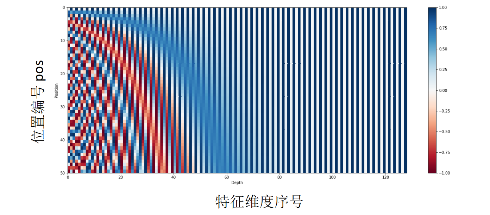

作者认为这种位置编码可以让模型很好地学习到相对位置的注意力，因为对于固定的k值，$PE_{pos+k}$可以表示为$PE_{pos}$的线性函数。

==问：如何理解这种位置编码的物理含义？==


#### *详细介绍矩阵的具体维度

矩阵具体维度参考：[图解 transformer——多头注意力（3） 作者：Ketan Doshi翻译：Afunby这是关于图解 transformer 系列的第三篇译文。该系列文章由 Ke... - 雪球 (xueqiu.com)](https://xueqiu.com/3993902801/284754798)

##### 输入层

经过<u>词嵌入和位置编码后</u>，<u>进入编码器之前</u>，输入的数据维度为：$B×L×C$（batch_size，seq_length，embedding_size）

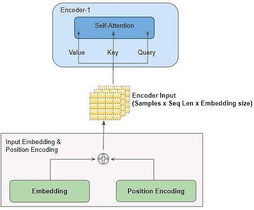


为方便理解，以下的图示与介绍中将去掉 batch_size 维度，聚焦于剩下的维度：

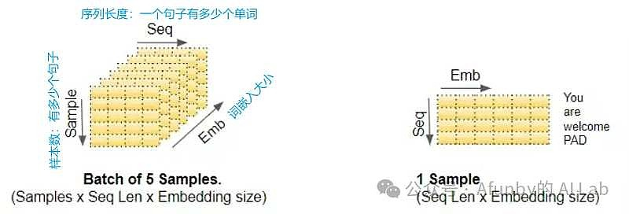


##### 线性层

之后数据进入编码器，与Query、Key、Value矩阵相乘，如下图所示。

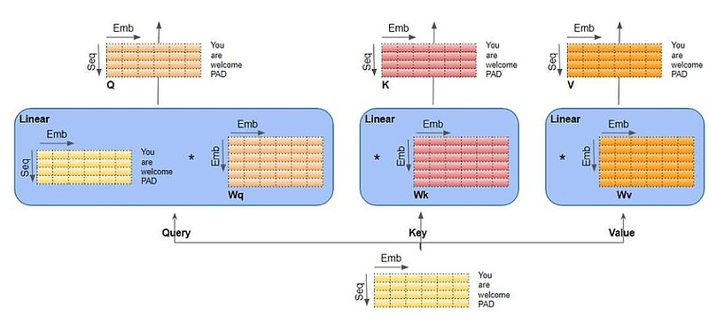

这里可以看见，Query、Key、Value矩阵实际上是三个独立的线性层，每个线性层带有不同的权重（**其实是对应论文原文中不同的$W_i^Q,W_i^K,W_i^V$矩阵**）。输入数据分别与三个矩阵相乘，得到矩阵$Q,K,V$.

线性层的维度是：（batch_size, embedding_size, Query_size * n_heads）

Q、K 和 V 矩阵形状是：（batch_size, seq_length, Query_size \* n_heads）


具体的实现代码如下：

①定义Query、Key、Value矩阵(线性层)

```python
        # define there linear layers for q, k, v generation separately
        self.q_layer = nn.Linear(embed_dim, embed_dim)
        self.k_layer = nn.Linear(embed_dim, embed_dim)
        self.v_layer = nn.Linear(embed_dim, embed_dim)
```

②将输入与Query、Key、Value矩阵作用得到QKV矩阵

```python
        q = self.q_layer(x)
        k = self.k_layer(x)
        v = self.v_layer(x)
        # the shape of q, k, v: (batch_size, seq_len, num_heads * head_dim)
```


##### 注意力头切分数据

根据如下的数值关系进行切分：
$$
d_q={d_{model}}/{h}\\
Query\ Size=Embedding\ Size/Number\ of\ heads
$$
示意图如下所示：

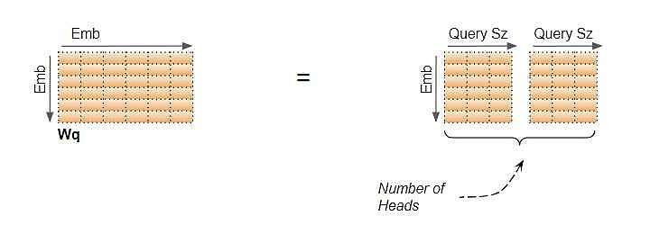

基于此，所有 Heads 的计算可通过对一个的矩阵操作来实现，而不需要 N 个单独操作。这使得计算更加有效，同时保持模型的简单：所需线性层更少，同时获得了多头注意力的效果.

**需要注意**：

1. “切分”只是逻辑上的分割。对于参数矩阵 Query, Key, Value 而言，并没有物理切分成对应于每个注意力头的独立矩阵，

2. 逻辑上，每个注意力头对应于 Query, Key, Value 的独立一部分。各注意力头没有单独的线性层，而是所有的注意力头共用线性层，只是不同的注意力头在独属于各自的逻辑部分上进行操作。


经由线性层输出得到的 Q、K 和 V 矩阵要经过 Reshape 操作，以产生一个 Head 维度。现在每个 "切片 "对应于代表每个头的一个矩阵。以Q矩阵为例：

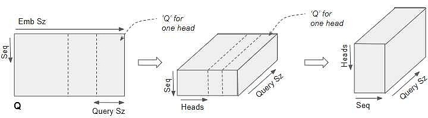

第一步首先对其embedding维度进行切分，切成h个头，并将这些切片摞起来。第二步将head 维度和seq_length维度进行交换。这样就会有很多(seq_length, Query Size)的切片。


具体实现代码如下：

```python
        # the shape of q, k, v: (batch_size, seq_len, num_heads * head_dim)
        # 产生num_head与head_dim维度——reshape
        q = q.reshape(batch_size,seq_len,num_heads,head_dim)
        k = k.reshape(batch_size,seq_len,num_heads,head_dim)
        v = v.reshape(batch_size,seq_len,num_heads,head_dim)
        
        #from (batch_size, seq_len, num_heads, head_dim) to (batch_size, num_heads, seq_len, head_dim)
        #交换第1、2维——swap
        q = q.transpose(1,2)
        k = k.transpose(1,2)
        v = v.transpose(1,2)
```


这一个矩阵变形的过程可以用下面的示意图表示：

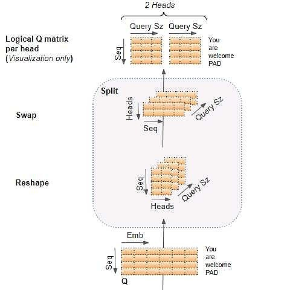


##### 为每个头计算注意力

为方便理解，只展示单个 head 的计算，也就是对(seq_length, Query Size)的切片进行计算。

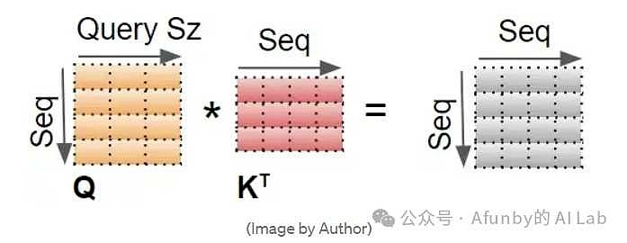

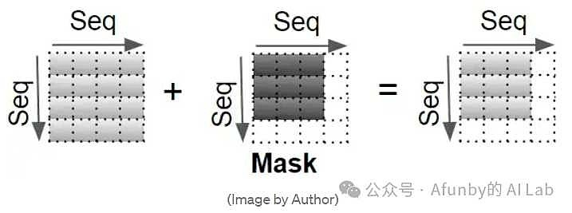

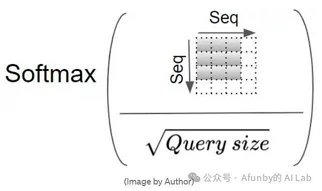

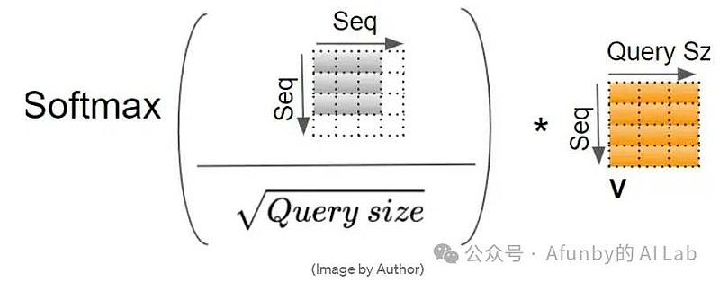

在编码器的自注意力机制中，一个注意力头完整的计算如下所示：

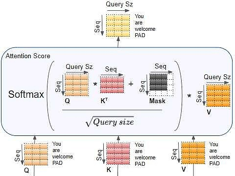

解码器的自注意力机制中，一个注意力头完整的计算如下所示：

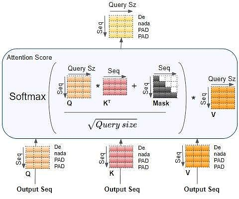

每个注意力头的输出形状为：（batch_size，n_heads，seq_length，Query size）.

注意，实际上此处最后一个维度的大小为 value_size，只是在 Transformer 中的 value_size=key_size=query_size。


具体的代码实现如下：

```python
attn = torch.matmul(q,k.transpose(2,3))/torch.sqrt(head_dim)
#使用mask进行掩码操作
attn_mask = torch.ones(seq_len,seq_len,device=x.device)
attn_mask = torch.triu(attn_mask,diagonal=1)
attn_mask = attn_mask.bool()
attn = attn.masked_fill(attn_mask,float('-inf'))

attn = torch.softmax(attn,dim=3)#沿着最后一个dim进行softmax
attn = self.attn_drop(attn)
out = torch.matmul(attn,v)
# the shape of `out`: (batch_size, num_heads, seq_len, head_dim)
```


##### 融合每个头的注意力分数

在这一步中要重塑矩阵的尺寸，让其恢复输入数据的尺寸。首先将head 维度和seq_length维度进行交换，得到尺寸（batch_size，seq_length，n_heads，Query_size），然后合并后两个维度，得到（batch_size，seq_length，embedding_size）

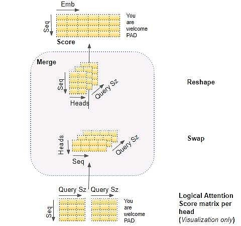

具体的代码实现如下：

```python
# from (batch_size, num_heads, seq_len, head_dim) to (batch_size, seq_len, num_heads*head_dim)
out = out.transpose(1,2)
out = out.reshape(batch_size,seq_len,num_heads*head_dim)
```


整体上**多头注意力**的计算过程如下：

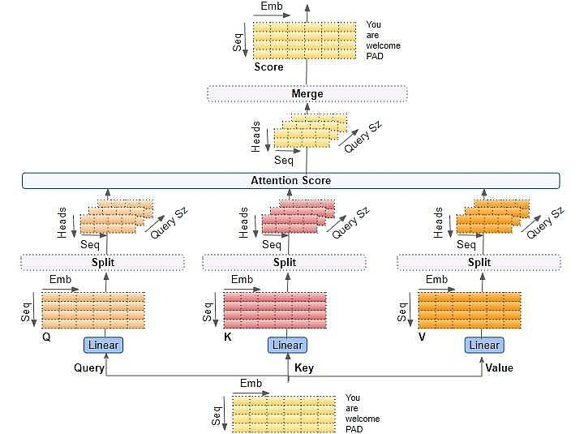


整体的GPT实现代码如下：

```python
class GPT(nn.Module):
    def __init__(self, vocab_size, max_seq_len, num_layer, embed_dim, num_head, feedforward_dim, dropout, no_res=False, no_pos=False):
        '''
            vocab_size: the size of vocabulary 
            max_seq_len: the maximum length of input texts 输入文本的最大长度
            num_layer: the number of transformer layers 本次作业层数为4
            embed_dim: the embedding dimension 嵌入后的维度
            num_head: the number of heads in Multi-Head Self Attention 自注意力头数，本次作业为4
            feedforward_dim: the dimension in the feed forward network
            dropout: dropout ratio
            no_res: whether to use residual connection in transformer layers
            no_pos: whether to use position embeddings
        '''
        super().__init__()
        self.num_layer = num_layer
        self.max_seq_len = max_seq_len
        self.no_pos = no_pos

        # Define Embedding Layer to transfer input text tokens and positions to embeddings
        self.word_token_embedding = nn.Embedding(vocab_size, embed_dim)
        self.word_pos_embedding = nn.Embedding(max_seq_len, embed_dim)

        self.drop = nn.Dropout(dropout)
        # Define the transformer layers
        self.transformer = nn.ModuleList([TransformerLayer(embed_dim, num_head, feedforward_dim, dropout, no_res) for _ in range(num_layer)])
        
        # Define the head layer to predict output
        self.norm = nn.LayerNorm(embed_dim)
        self.language_model_head = nn.Linear(embed_dim, vocab_size, bias=False)

        """
        Weight tying improves the performance of language models by tying (sharing) the weights of the embedding and softmax layers.
        Reference: https://paperswithcode.com/method/weight-tying
        """
        self.word_token_embedding.weight = self.language_model_head.weight

        self.init_weights()

    def init_weights(self):
        for m in self.modules():
            if isinstance(m, nn.Linear):
                torch.nn.init.normal_(m.weight, mean=0.0, std=0.02)
                if m.bias is not None:
                    torch.nn.init.zeros_(m.bias)
            elif isinstance(m, nn.Embedding):
                torch.nn.init.normal_(m.weight, mean=0.0, std=0.02)
        
        # apply special scaled init to the residual projections, per GPT-2 paper
        for pn, p in self.named_parameters():
            if pn.endswith('proj_layer.weight'):
                torch.nn.init.normal_(p, mean=0.0, std=0.02/math.sqrt(2 * self.num_layer))

    
    def forward(self, word_idx, targets=None):
        batch_size, seq_len = word_idx.shape

        # >>> TODO 3: complete the forward process of GPT
        # Step 3.1: use torch.arange(?, dtype=torch.long, device=word_idx.device) to generate the position sequence `pos` [0, 1, ..., seq_len-1] 
        pos = torch.arange(seq_len, dtype=torch.long, device=word_idx.device)

        # Step 3.2: use self.word_token_embedding() and self.word_pos_embedding() to transfer `word_idx` and `pos` to embeddings ('token_embed` and `pos_embed`)
        token_embed = self.word_token_embedding(word_idx)
        pos_embed = self.word_pos_embedding(pos)

        # Step 3.3: initialize the input embeddings `x` of transformer layers
        # add the token embeddings and position embeddings to obtain the input embeddings `x` if self.no_pos is False
        if self.no_pos:
            x = token_embed
        else:
            x = token_embed+pos_embed

        # apply dropout to the input embeddings via `self.drop()`
        x = self.drop(x)

        # Step 3.4: use for loop to obtain the output and attention weights of multiple transformer layers
        # define a list `attention_weights` and append the attention weights of each transformer layer into the list
        attention_weights = [] 
        for layer in self.transformer:
            # Step 4.1: obtain the output and attention weights of transformer layers
            x, attn = layer(x)
            # Step 4.2: append the attention weights of transformer layers into the list `attention_weights`
            attention_weights.append(attn)
     
        # Step 3.5: use self.norm() to normalize the output of transformer layers and then use self.language_model_head() to obtain the `logits` for prediction
        # self.language_model_head() is a linear layer defined in __init__() function
        # Note: do not add softmax here since it is included in the cross entropy loss function
        x = self.norm(x)
        logits = self.language_model_head(x)
        # <<< TODO 3

        # return logits and loss or attention weights
        if targets is not None:
            loss = torch.nn.functional.cross_entropy(logits.reshape(-1, logits.size(-1)), targets.reshape(-1), ignore_index=0)
            return logits, loss
        assert isinstance(attention_weights, list), "attention_weights must be a list, please check whether to append the attention weights of all transformer layers into it!"
        return logits, attention_weights

    def configure_optimizers(self, weight_decay):
        """
        This long function is unfortunately doing something very simple and is being very defensive:
        We are separating out all parameters of the model into two buckets: those that will experience
        weight decay for regularization and those that won't (biases, and layernorm/embedding weights).
        We are then returning the PyTorch optimizer object.
        """

        # separate out all parameters to those that will and won't experience regularizing weight decay
        decay = set()
        no_decay = set()
        whitelist_weight_modules = (nn.Linear, )
        blacklist_weight_modules = (nn.LayerNorm, torch.nn.Embedding)
        for mn, m in self.named_modules():
            for pn, p in m.named_parameters():
                fpn = '%s.%s' % (mn, pn) if mn else pn # full param name
                # random note: because named_modules and named_parameters are recursive
                # we will see the same tensors p many many times. but doing it this way
                # allows us to know which parent module any tensor p belongs to...
                if pn.endswith('bias'):
                    # all biases will not be decayed
                    no_decay.add(fpn)
                elif pn.endswith('weight') and isinstance(m, whitelist_weight_modules):
                    # weights of whitelist modules will be weight decayed
                    decay.add(fpn)
                elif pn.endswith('weight') and isinstance(m, blacklist_weight_modules):
                    # weights of blacklist modules will NOT be weight decayed
                    no_decay.add(fpn)

        # subtle: 'transformer.wte.weight' and 'lm_head.weight' are tied, so they
        # will appear in the no_decay and decay sets respectively after the above.
        # In addition, because named_parameters() doesn't return duplicates, it
        # will only return the first occurence, key'd by 'transformer.wte.weight', below.
        # so let's manually remove 'lm_head.weight' from decay set. This will include
        # this tensor into optimization via transformer.wte.weight only, and not decayed.
        decay.remove('language_model_head.weight')

        # validate that we considered every parameter
        param_dict = {pn: p for pn, p in self.named_parameters()}
        inter_params = decay & no_decay
        union_params = decay | no_decay
        assert len(inter_params) == 0, "parameters %s made it into both decay/no_decay sets!" % (str(inter_params), )
        assert len(param_dict.keys() - union_params) == 0, "parameters %s were not separated into either decay/no_decay set!" \
                                                    % (str(param_dict.keys() - union_params), )

        # create the pytorch optimizer object
        optim_groups = [
            {"params": [param_dict[pn] for pn in sorted(list(decay))], "weight_decay": weight_decay},
            {"params": [param_dict[pn] for pn in sorted(list(no_decay))], "weight_decay": 0.0},
        ]
        return optim_groups
    
    @torch.no_grad()
    def generate(self, idx, max_new_tokens, temperature=1.0, top_k=None):
        """
        Take a conditioning sequence of indices idx (LongTensor of shape (b,t)) and complete
        the sequence max_new_tokens times, feeding the predictions back into the model each time.
        Most likely you'll want to make sure to be in model.eval() mode of operation for this.
        """
        for _ in range(max_new_tokens):
            # if the sequence context is growing too long we must crop it at block_size
            idx_cond = idx
            # forward the model to get the logits for the index in the sequence
            logits, _ = self(idx_cond)
            # pluck the logits at the final step and scale by desired temperature
            logits = logits[:, -1, :] / temperature
            # optionally crop the logits to only the top k options
            if top_k is not None:
                v, _ = torch.topk(logits, min(top_k, logits.size(-1)))
                logits[logits < v[:, [-1]]] = -float('Inf')
            # apply softmax to convert logits to (normalized) probabilities
            probs = F.softmax(logits, dim=-1)
            # sample from the distribution
            idx_next = torch.multinomial(probs, num_samples=1)
            # append sampled index to the running sequence and continue
            idx = torch.cat((idx, idx_next), dim=1)

        return idx.squeeze().cpu().numpy()
```


### 二、方法论：为什么要使用注意力机制？

①减少每层的运算复杂度。(total computational complexity per layer).

②能够并行的计算数量——由所需的最小顺序操作数来衡量。(measured by the minimum number of sequential operations required.)

③网络中长范围依赖(long-range dependencies)的路径长度(path-length)更低，有利于模型学习到更丰富的远距离依赖。

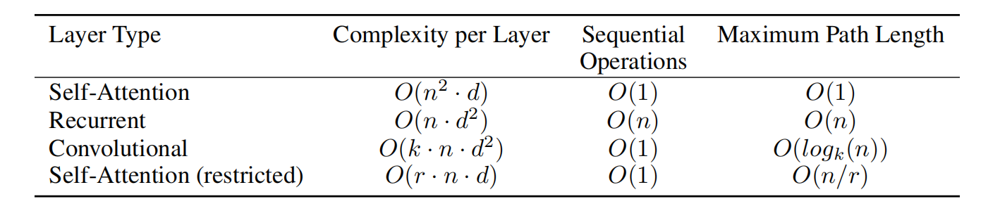


### 符号表示的统一

鉴于论文、解析文章以及媒认hw4中的符号表示有所区别，因此在这里制表统一。

|        论文原文        |  媒认课件  |     媒认代码     |             解析文章             |
| :--------------------: | :--------: | :--------------: | :------------------------------: |
|                        | batch_size |    batch_size    |            batch_size            |
|                        |  seq_len   |     seq_len      |            seq_length            |
|      $d_{model}$       | embed_dim  |                  |          embedding_size          |
|                        | num_heads  |    num_heads     |             n_heads              |
|     $d_q/d_k/d_v$      |  head_dim  |     head_dim     |       query/key/value_size       |
|                        |            |                  |                                  |
|         Inputs         |            |        x         |            input = X             |
|  $W_i^Q/W_i^K/W_i^V$   |            | self.q/k/v_layer |         Query/Key/Value          |
| $QW_i^Q/KW_i^K/VW_i^V$ |            |      q/k/v       | Q/K/V = Query(X)/Key(X)/Value(X) |
|                        |            |                  |                                  |
|                        |            |                  |                                  |
|                        |            |                  |                                  |

注：①在 Transformer 中的 value_size=key_size=query_size。