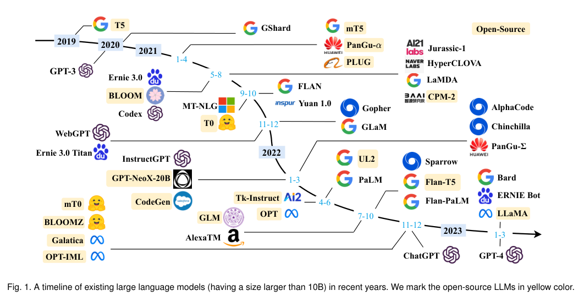
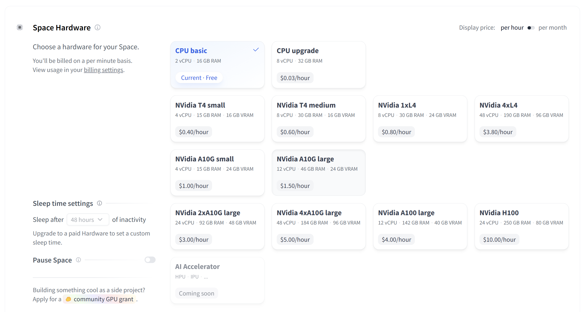
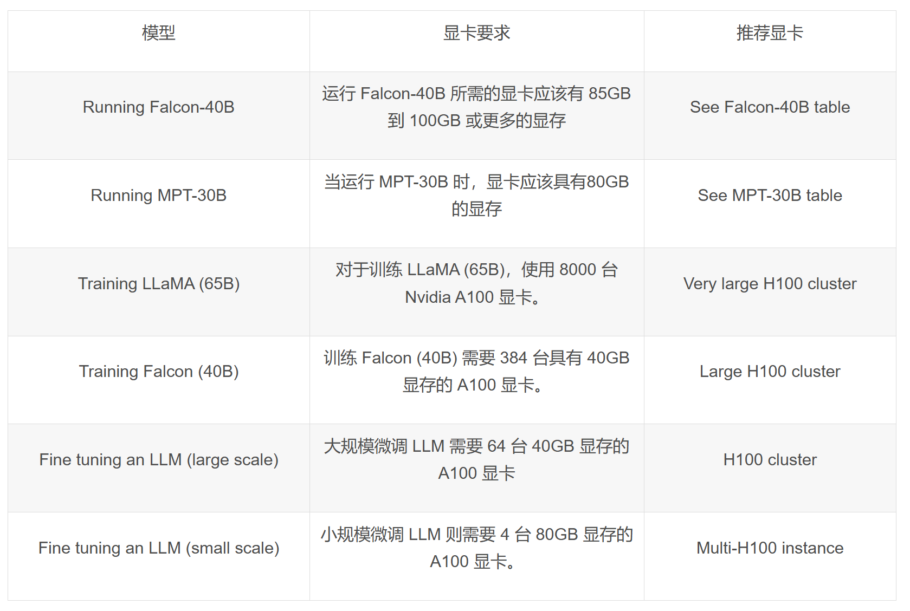
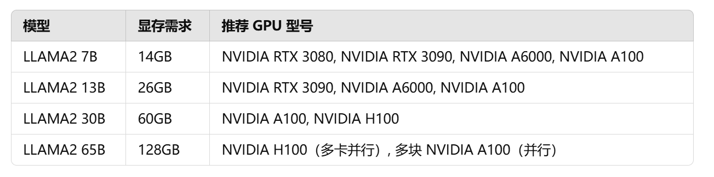
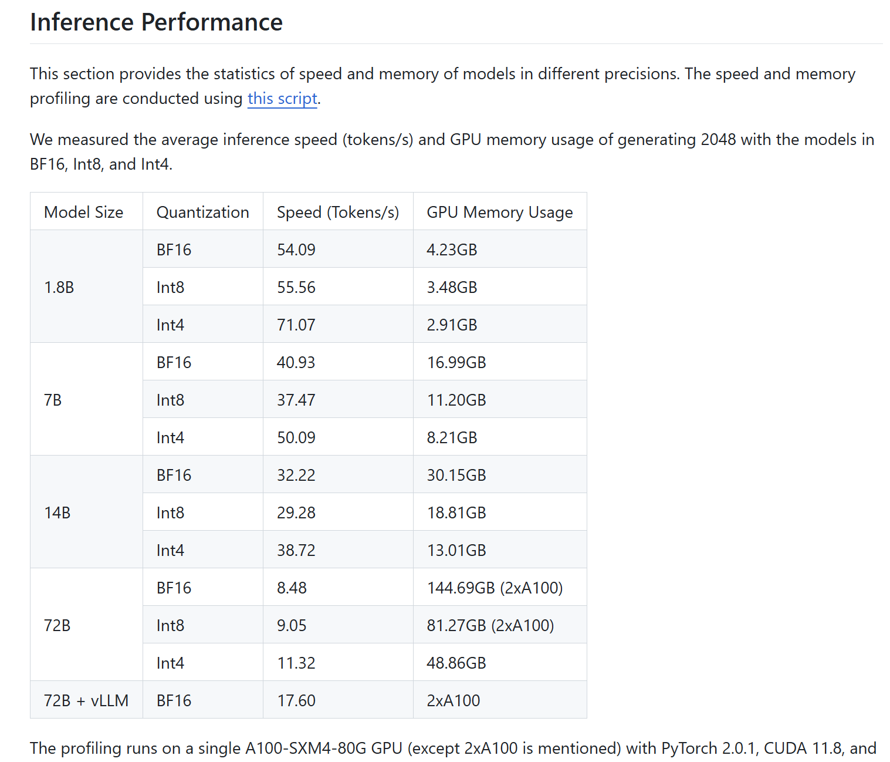

# 基座模型

[自然语言处理前沿——大语言模型的前世今生 (tongji.edu.cn)](https://shmc.tongji.edu.cn/8c/8e/c32676a298126/page.htm)

前身——基于Transformer架构的GPT/BERT等

分类：Base模型/Chat模型

#### 比较领先的大语言模型

GPT-4、Claude3、Gemini、Grok、ChatGLM4

#### 可用的大语言模型（众多）

llama3（8B/70B）——填写问卷申请[meta-llama/Meta-Llama-3-8B · Hugging Face](https://huggingface.co/meta-llama/Meta-Llama-3-8B)、[meta-llama/Meta-Llama-3-70B · Hugging Face](https://huggingface.co/meta-llama/Meta-Llama-3-70B)

Gemma（7B）——填写问卷申请[google/gemma-7b · Hugging Face](https://huggingface.co/google/gemma-7b)

GLM3（6B）——[THUDM (github.com)](https://github.com/THUDM)、[THUDM (Knowledge Engineering Group (KEG) & Data Mining at Tsinghua University) (huggingface.co)](https://huggingface.co/THUDM)

Phi2（2.7B）——[microsoft/phi-2 · Hugging Face](https://huggingface.co/microsoft/phi-2)

开源轻量级模型：[1-7B开源小型预训练语言模型整理汇总 - 知乎 (zhihu.com)](https://zhuanlan.zhihu.com/p/657476941)

模型汇总：[大模型综合评测对比 | 当前主流大模型在各评测数据集上的表现总榜单 | 数据学习 (DataLearner)](https://www.datalearner.com/ai-models/leaderboard/datalearner-llm-leaderboard)

### 常用的通用模型

*下面的很多模型都是基于通用模型在具体垂直领域进行微调。*

| 模型                                                   | 大小                                                | 机构                                               | 论文                                                         |
| ------------------------------------------------------ | --------------------------------------------------- | -------------------------------------------------- | ------------------------------------------------------------ |
| [LLaMA2](https://github.com/facebookresearch/llama)    | 7B/7B-Chat 13B/13B-Chat 70B/70B-Chat                | [Meta](https://ai.meta.com/)                       | [paper](https://arxiv.org/abs/2307.09288)                    |
| [ChatGLM3-6B](https://github.com/THUDM/ChatGLM3)       | 6B-Base/6B/6B-32K                                   | [清华大学](https://github.com/THUDM/ChatGLM3)      | [paper](https://arxiv.org/abs/2210.02414)                    |
| [Qwen](https://github.com/QwenLM/Qwen)                 | 1.8B/1.8B-Chat 7B/7B-Chat 14B/14B-Chat 72B/72B-Chat | [阿里云](https://qianwen.aliyun.com/)              | [paper](https://arxiv.org/abs/2309.16609)                    |
| [Baichuan2](https://github.com/baichuan-inc/Baichuan2) | 7B/7B-Chat 13B/13B-Chat                             | [百川智能](https://www.baichuan-ai.com/home)       | [paper](https://arxiv.org/abs/2309.10305)                    |
| [InternLM](https://github.com/InternLM/InternLM)       | 7B/7B-Chat 20B/20B-Chat                             | [上海AI实验室](https://internlm.intern-ai.org.cn/) | [paper](https://github.com/InternLM/InternLM-techreport/blob/main/InternLM.pdf) |

# 垂直领域

已经很丰富的整理：

[luban-agi/Awesome-Domain-LLM: 收集和梳理垂直领域的开源模型、数据集及评测基准。 (github.com)](https://github.com/luban-agi/Awesome-Domain-LLM)（截至[2023/11/26]）

[层出不穷的垂域微调大模型非最全汇总：12大领域、57个领域微调模型概述及对垂直行业问答的一些讨论](https://mp.weixin.qq.com/s/ur47_5Zx9IQUUduciEO3jQ)（截至[2023/09/13]）

[lonePatient/awesome-pretrained-chinese-nlp-models: Awesome Pretrained Chinese NLP Models，高质量中文预训练模型&大模型&多模态模型&大语言模型集合 (github.com)](https://github.com/lonePatient/awesome-pretrained-chinese-nlp-models)（截至[2024/05/20]）

[DSXiangLi/DecryptPrompt: 总结Prompt&LLM论文，开源数据&模型，AIGC应用 (github.com)](https://github.com/DSXiangLi/DecryptPrompt)

<h3 align="center">----整理----</h3>

### 医疗领域

**中文医疗知识/对话/教育**：[AlpaCare](https://github.com/XZhang97666/AlpaCare) 、**[BenTsao(本草)](https://github.com/SCIR-HI/Huatuo-Llama-Med-Chinese)**、[BianQue(扁鹊)](https://github.com/scutcyr/BianQue)、**[CareGPT](https://github.com/WangRongsheng/CareGPT)**、[ChatMed](https://github.com/michael-wzhu/ChatMed)、[ChiMed-GPT](https://github.com/synlp/ChiMed-GPT)、**[Chinese-vicuna-med](https://github.com/Facico/Chinese-Vicuna)**、[DISC-MedLLM](https://github.com/FudanDISC/DISC-MedLLM)、**[DoctorGLM](https://github.com/xionghonglin/DoctorGLM)**、**[HuatuoGPT(华佗)](https://github.com/FreedomIntelligence/HuatuoGPT)**、[IvyGPT](https://github.com/WangRongsheng/IvyGPT)、**[MedicalGPT](https://github.com/shibing624/MedicalGPT)**、**[Med-ChatGLM](https://github.com/SCIR-HI/Med-ChatGLM)**、**[MING](https://github.com/MediaBrain-SJTU/MING)**、[PULSE](https://github.com/openmedlab/PULSE)、**[QiZhenGPT](https://github.com/CMKRG/QiZhenGPT)**、[WiNGPT2](https://github.com/winninghealth/WiNGPT2)、[Sunsimiao (孙思邈)](https://github.com/thomas-yanxin/Sunsimiao)、

**英文医疗知识/对话**：**[ChatDoctor](https://github.com/Kent0n-Li/ChatDoctor)**、[medAlpaca](https://github.com/kbressem/medAlpaca)、[NHS-LLM](https://github.com/CogStack/OpenGPT/tree/main)、**[PMC-LLaMA](https://github.com/chaoyi-wu/PMC-LLaMA)**、

**中医知识**：[HuangDI (皇帝)](https://github.com/Zlasejd/HuangDI) 、[ShenNong-TCM-LLM (神农)](https://github.com/michael-wzhu/ShenNong-TCM-LLM)、[TCMLLM](https://github.com/2020MEAI/TCMLLM)、[ZhongJing (仲景)](https://github.com/pariskang/CMLM-ZhongJing)、[Zhongjing-LLaMA (仲景)](https://github.com/SupritYoung/Zhongjing)、

**心理健康**：[ChatPsychiatrist](https://github.com/EmoCareAI/ChatPsychiatrist)、[MentalLLaMA](https://github.com/SteveKGYang/MentalLLaMA)、[MeChat](https://github.com/qiuhuachuan/smile)、[MindChat (漫谈)](https://github.com/X-D-Lab/MindChat)

**生物医学**：**[OpenBioMed](https://github.com/PharMolix/OpenBioMed)**(多模态)、[SoulChat (灵心)](https://github.com/scutcyr/SoulChat)、[Taiyi (太一)](https://github.com/DUTIR-BioNLP/Taiyi-LLM) 

**胸部光片**：**[XrayGLM](https://github.com/WangRongsheng/XrayGLM )**

**儿童陪伴**：[QiaoBan (巧板)](https://github.com/HIT-SCIR-SC/QiaoBan) 

### 金融领域

**知识问答/场景分析/计算检索**：[BBT-FinCUGE-Applications](https://github.com/ssymmetry/BBT-FinCUGE-Applications)、[CFGPT](https://github.com/TongjiFinLab/CFGPT)、[DeepMoney](https://sota.jiqizhixin.com/project/deepmoney)、[DISC-FinLLM](https://github.com/FudanDISC/DISC-FinLLM)、[PIXIU (貔貅)](https://github.com/chancefocus/PIXIU)、**[Tongyi-Finance-14B](https://modelscope.cn/models/TongyiFinance/Tongyi-Finance-14B/summary)**、**[Cornucopia (聚宝盆)](https://github.com/jerry1993-tech/Cornucopia-LLaMA-Fin-Chinese)** 、**[XuanYuan (轩辕)](https://github.com/Duxiaoman-DI/XuanYuan)**、[XuanYuan2.0 ](https://huggingface.co/xyz-nlp/XuanYuan2.0)

**英文**：[FLANG](https://github.com/SALT-NLP/FLANG)、[InvestLM](https://github.com/AbaciNLP/InvestLM)、[WeaverBird (织工鸟)](https://github.com/ant-research/fin_domain_llm)(双语对话)、

**其他**：**[FinGLM](https://github.com/MetaGLM/FinGLM)**(解析上市公司年报)、**[FinGPT](https://github.com/AI4Finance-Foundation/FinGPT)**(多个金融大模型)、[InvestLM](https://github.com/AbaciNLP/InvestLM)(金融考试、投资问题等)、

### 法律领域

**法律服务/知识**：**[ChatLaw](https://github.com/PKU-YuanGroup/ChatLaw)**、[DISC-LawLLM](https://github.com/FudanDISC/DISC-LawLLM)、[夫子•明察](https://github.com/irlab-sdu/fuzi.mingcha)、[JurisLMs](https://github.com/seudl/JurisLMs)、**[LaWGPT](https://github.com/pengxiao-song/LaWGPT)** 、**[LawGPT_zh (獬豸)](https://github.com/LiuHC0428/LAW-GPT)**、**[Lawyer LLaMA](https://github.com/AndrewZhe/lawyer-llama)**、**[LexiLaw](https://github.com/CSHaitao/LexiLaw)**、[Lychee (律知)](https://github.com/davidpig/lychee_law)、[HanFei (韩非)](https://github.com/siat-nlp/HanFei) 、[wisdomInterrogatory (智海-录问)](https://github.com/zhihaiLLM/wisdomInterrogatory)、**[XuanYuan](https://github.com/Duxiaoman-DI/XuanYuan)**

### 编程领域

**代码**：**[Aquila](https://github.com/FlagAI-Open/FlagAI/tree/master/examples/Aquila)**、[ChatSQL](https://github.com/cubenlp/ChatSQL)、**[codegeex](http://keg.cs.tsinghua.edu.cn/codegeex/index_zh.html)**、**[codegeex2](https://github.com/THUDM/CodeGeeX2)**、**[codegemma-7b](https://huggingface.co/google/codegemma-7b)**、**[codellama](https://github.com/facebookresearch/codellama)**、**[CodeQwen1.5-7B-Chat](https://hf-mirror.com/Qwen/CodeQwen1.5-7B-Chat)**、**[codeshell](https://github.com/WisdomShell/codeshell)**、**[DeepSeek-Coder](https://github.com/deepseek-ai/DeepSeek-Coder)**、**[DeepSeekMoE](https://github.com/deepseek-ai/DeepSeek-MoE)**、**[MFTCoder](https://github.com/codefuse-ai/MFTCoder)**、[stabelcode](https://stability.ai/blog/stablecode-llm-generative-ai-coding)、**[SQLCoder](https://github.com/defog-ai/sqlcoder)**、**[Starcoder](https://github.com/bigcode-project/starcoder)**、[WaveCoder](https://github.com/microsoft/WaveCoder)

### 教育领域

**教育服务**：**[EduChat](https://github.com/icalk-nlp/EduChat)**、[TuringMM-34B-Chat](https://huggingface.co/lightyear-turing/TuringMM-34B-Chat)

**国际中文教育**：[桃李 (Taoli)](https://github.com/blcuicall/taoli)

### 数学领域

**讲题**：[MathGPT](https://www.mathgpt.com/)

**解决问题**：[MammoTH](https://tiger-ai-lab.github.io/MAmmoTH/)、[MetaMath](https://github.com/meta-math/MetaMath)、[Skywork-13B-Math](https://huggingface.co/Skywork/Skywork-13B-Math)、**[WizardMath](https://github.com/nlpxucan/WizardLM/tree/main/WizardMath)**

### 其他领域

**化学**：[OpenDFM/ChemDFM-13B-v1.0](https://huggingface.co/OpenDFM/ChemDFM-13B-v1.0)

**地球科学**：[K2](https://github.com/davendw49/k2)

**植物科学**：[PLLaMa](https://github.com/Xianjun-Yang/PLLaMa)

**天文学**：[StarWhisper (星语)](https://github.com/Yu-Yang-Li/StarWhisper)

**海洋学**：[MarineGPT](https://github.com/hkust-vgd/MarineGPT)(熟悉海洋动物知识，能识图)、[OceanGPT](https://arxiv.org/abs/2310.02031)(海洋学领域专家)

**农业**：[AgriGPT](https://github.com/AgriGPTs/AgriGPTs)

**自媒体**：[MediaGPT](https://github.com/IMOSR/MediaGPT)

**电商**：[EcomGPT](https://github.com/Alibaba-NLP/EcomGPT)

**网络安全**：[AutoAudit](https://github.com/ddzipp/AutoAudit)、**[SecGPT](https://github.com/Clouditera/secgpt)**

**科技**：[Mozi (墨子)](https://github.com/gmftbyGMFTBY/science-llm)(科技文献)、[TechGPT](https://github.com/neukg/TechGPT)(众多垂直领域)

**交通**：**[TransGPT (致远)](https://github.com/DUOMO/TransGPT)**(通用常识交通大模型)

**故事生成**：**[ChatRWKV](https://github.com/BlinkDL/ChatRWKV)**

**音乐生成**：**[facebook/musicgen-medium](https://huggingface.co/facebook/musicgen-medium)**

**评估模型**：[ Auto-J](https://modelscope.cn/models/lockonlvange/autoj-13b-fp16/summary)、**[ JudgeLM](https://github.com/baaivision/JudgeLM)**

**运维**：**[DevOps-Model](https://github.com/codefuse-ai/CodeFuse-DevOps-Model)**、[OWL](https://github.com/HC-Guo/Owl)

**舆情安全**：**[YaYi (雅意)](https://github.com/wenge-research/YaYi)**(覆盖媒体宣传、舆情分析、公共安全、金融风控、城市治理等五大领域)

更杂的一些工具：

| 工具描述                                                     | 链接                                                         |
| ------------------------------------------------------------ | ------------------------------------------------------------ |
| GPT4v-ACT：基于JS DOM识别网页元素，服务于各类多模态webagent  | https://github.com/ddupont808/GPT-4V-Act?tab=readme-ov-file  |
| Deep-KE：基于LLM对数据进行智能解析实现知识抽取               | https://github.com/zjunlp/DeepKE                             |
| IncarnaMind：多文档RAG方案，动态chunking的方案可以借鉴       | https://github.com/junruxiong/IncarnaMind                    |
| Vectra：平台化的LLM Agent搭建方案，从索引构建，内容召回排序，到事实检查的LLM生成 | https://vectara.com/tour-vectara/                            |
| Data-Copilot：时间序列等结构化数据分析领域的Agent解决方案    | https://github.com/zwq2018/Data-Copilot                      |
| DB-GPT: 以数据库为基础的GPT实验项目，使用本地化的GPT大模型与您的数据和环境进行交互 | https://db-gpt.readthedocs.io/projects/db-gpt-docs-zh-cn/zh_CN/latest/index.html |
| guardrails：降低模型幻觉的python框架，promp模板+validation+修正 | https://github.com/shreyar/guardrails                        |
| guidance：微软新开源框架，同样是降低模型幻觉的框架，prompt+chain的升级版加入逐步生成和思维链路 | https://github.com/guidance-ai/guidance                      |
| SolidGPT: 上传个人数据，通过命令交互创建项目PRD等            | https://github.com/AI-Citizen/SolidGPT                       |
| HR-Agent: 类似HR和员工交互，支持多工具调用                   | https://github.com/stepanogil/autonomous-hr-chatbot          |
| BambooAI：数据分析Agent                                      | https://github.com/pgalko/BambooAI                           |
| AlphaCodium：通过Flow Engineering完成代码任务                | https://github.com/Codium-ai/AlphaCodium                     |
| REOR: AI驱动的笔记软件                                       | https://github.com/reorproject/reor                          |
| Vanna.AI: chat with sql database                             | https://vanna.ai/                                            |
| ScrapeGraph：融合了图逻辑和LLM                               | https://scrapegraph-doc.onrender.com/                        |
| OpenAct：Adapt-AI推出了的和桌面GUI交互的Agent框架            | https://github.com/OpenAdaptAI/OpenAdapt                     |
| LaVague：WebAgent框架，偏低层指令交互性把指令转换成Selenium代码去和网页交互 | https://github.com/lavague-ai/LaVague/tree/main              |
| Tarsier: webagent的辅助工具把网站转换成可交互元素序号和描述  | https://github.com/reworkd/tarsier?tab=readme-ov-file        |
| RecAI：微软推出的推荐领域LLM Agent                           | https://github.com/microsoft/RecAI                           |

### Diffusion Models

#### 图像

**DALL-E 2**：[openai/DALL-E: PyTorch package for the discrete VAE used for DALL·E. (github.com)](https://github.com/openai/DALL-E)

**Stable Diffusion**：[Stability-AI/stablediffusion: High-Resolution Image Synthesis with Latent Diffusion Models (github.com)](https://github.com/Stability-AI/StableDiffusion)

**Disco Diffusion**：[Alembics/Disco-diffusion (github.com)](https://github.com/alembics/disco-diffusion)

**DDPM**：[hojonathanho/diffusion: Denoising Diffusion Probabilistic Models (github.com)](https://github.com/hojonathanho/diffusion)

**GLIDE**：[openai/glide-text2im: GLIDE: a diffusion-based text-conditional image synthesis model (github.com)](https://github.com/openai/glide-text2im)

在Hugging Face上有很多开源扩散模型，也有很多基于LoRA的微调。

#### 音频

**WaveGrad**：[ivanvovk/WaveGrad: Implementation of WaveGrad high-fidelity vocoder from Google Brain in PyTorch. (github.com)](https://github.com/ivanvovk/WaveGrad)

**DiffWave**：[lmnt-com/diffwave: DiffWave is a fast, high-quality neural vocoder and waveform synthesizer. (github.com)](https://github.com/lmnt-com/diffwave)

### 音频处理

主要是基于wav2vec、HUBERT之类的模型。

[lmnt-com/diffwave: DiffWave is a fast, high-quality neural vocoder and waveform synthesizer. (github.com)](https://github.com/lmnt-com/diffwave)

[facebook/wav2vec2-large-xlsr-53 · Hugging Face](https://huggingface.co/facebook/wav2vec2-large-xlsr-53)

[facebook/hubert-base-ls960 · Hugging Face](https://huggingface.co/facebook/hubert-base-ls960)

[TencentGameMate/chinese-wav2vec2-base · Hugging Face](https://huggingface.co/TencentGameMate/chinese-wav2vec2-base)

[TencentGameMate/chinese-hubert-base · Hugging Face](https://huggingface.co/TencentGameMate/chinese-hubert-base)

### 多模态

| 模型                     | 大小   | 时间    | 语言模型                                                     | 非语言模型                                                   | 语言 | 领域      | 下载                                                         | 项目地址                                                     | 机构/个人                                                    | 文献                                                         |
| ------------------------ | ------ | ------- | ------------------------------------------------------------ | ------------------------------------------------------------ | :--: | --------- | ------------------------------------------------------------ | ------------------------------------------------------------ | ------------------------------------------------------------ | ------------------------------------------------------------ |
| HunyuanDiT               | 1.5B   | 2024-05 | multilingual T5 encoder                                      | CLIP                                                         | 中英 | 文图      | [🤗](https://hf-mirror.com/Tencent-Hunyuan/HunyuanDiT)        | **[HunyuanDiT](https://github.com/Tencent/HunyuanDiT)**      | [Tencent](https://github.com/Tencent)                        | [Paper](https://arxiv.org/abs/2405.08748)                    |
| **CogVLM2**              |        | 2024-05 | Meta-Llama-3-8B-Instruct                                     | /                                                            | 中英 | 文图      | [🤗](https://hf-mirror.com/THUDM/cogvlm2-llama3-chat-19B)     | [CogVLM](https://github.com/THUDM/CogVLM)                    | [Skip to content](https://github.com/THUDM#start-of-content) |                                                              |
| 360VL                    | 8/70B  | 2024-05 | LLama3                                                       | CLIP-ViT                                                     | 中英 | 文图      | [🤗](https://hf-mirror.com/qihoo360)                          | [360VL](https://github.com/360CVGroup/360VL)                 | [360CVGroup](https://github.com/360CVGroup)                  |                                                              |
| **XVERSE-V**             | 13B    | 2024-05 | **XVERSE-13B-Chat**                                          | **clip-vit-large-patch14-224**                               | 中英 | 文图      | [🤖](https://modelscope.cn/models/xverse/XVERSE-V-13B/summary) | [XVERSE-V-13B](https://github.com/xverse-ai/XVERSE-V-13B)    | [xverse-ai](https://github.com/xverse-ai)                    |                                                              |
| MiniCPM-V 2.0            | 2.8B   | 2024-04 | [MiniCPM-2.4B](https://github.com/OpenBMB/MiniCPM/)          | SigLip-400M                                                  | 中英 | 文图      | [🤗](https://huggingface.co/openbmb/OmniLMM-12B/) [🤖](http://120.92.209.146:8081/) | **[MiniCPM-V](https://github.com/OpenBMB/MiniCPM-V)**        | [OpenBMB](https://github.com/OpenBMB)                        | [Blog](https://openbmb.vercel.app/minicpm-v-2)               |
| **Qwen-Audio**           | 7B     | 2024-03 | [Qwen-7B](https://github.com/QwenLM/Qwen)                    | [Whisper-large-v2](https://github.com/openai/whisper)        | 中英 | 文音      | [🤗HF](https://huggingface.co/Qwen/Qwen-Audio)                | [Qwen-Audio](https://github.com/QwenLM/Qwen-Audio)  | [Qwen](https://github.com/QwenLM)                            | [Paper](http://arxiv.org/abs/2311.07919)                     |
| DeepSeek-VL              | 1.3/7B | 2024-03 | DeepSeek                                                     | SigLip/SAM                                                   | 中英 | 图文      | [🤗HF](https://huggingface.co/deepseek-ai/deepseek-vl-7b-chat) | [DeepSeek-VL](https://github.com/deepseek-ai/DeepSeek-VL) | [deepseek-ai](https://github.com/deepseek-ai)                | [Paper](https://arxiv.org/abs/2403.05525)                    |
| **OmniLMM**              | 3/12B  | 2024-02 | MiniCPM                                                      | SigLip                                                       | 中英 | 图文      | [🤗HF](https://huggingface.co/openbmb/MiniCPM-V)              | [OmniLMM](https://github.com/OpenBMB/OmniLMM) | [[OpenBMB](https://github.com/OpenBMB)](https://github.com/01-ai) |                                                              |
| **MiniCPM-V**            | 3B     | 2024-02 | MiniCPM-2.4B                                                 | SigLip-400M                                                  | 中英 | 图文      | [🤗HF](https://huggingface.co/openbmb/MiniCPM-V)              | [OmniLMM](https://github.com/OpenBMB/OmniLMM) | [[OpenBMB](https://github.com/OpenBMB)](https://github.com/01-ai) |                                                              |
| Yi-VL                    | 6/34B  | 2024-01 | Yi                                                           | [CLIP-VIT](https://huggingface.co/laion/CLIP-ViT-H-14-laion2B-s32B-b79K) | 中英 | 图文      | [[🤗HF\]](https://huggingface.co/01-ai)                       | [Yi](https://github.com/01-ai/Yi) | [01-ai](https://github.com/01-ai)                            |                                                              |
| Lyrics                   | 14B    | 2023-12 | /                                                            | /                                                            | 中英 | 图文      | [[🤗HF\]](https://huggingface.co/IDEA-CCNL/Ziya-Visual-Lyrics-14B) | [Fengshenbang-LM](https://github.com/IDEA-CCNL/Fengshenbang-LM) | [IDEA研究院](https://github.com/IDEA-CCNL)                   |                                                              |
| Qwen-Audio               | 7B     | 2023-12 | [Qwen-7B](https://github.com/QwenLM/Qwen)                    | [Whisper-large-v2](https://github.com/openai/whisper)        | 中英 | 文音      | [[🤗HF\]](https://huggingface.co/Qwen)                        | [Qwen-Audio](https://github.com/QwenLM/Qwen-Audio) | [Qwen](https://github.com/QwenLM)                            | [Paper](http://arxiv.org/abs/2311.07919)                     |
| SPHINX                   | 13B    | 2023-10 | /                                                            | /                                                            | 中英 | 图文      | [[🤗HF\]](https://huggingface.co/Alpha-VLLM/SPHINX)           | [LLaMA2-Accessory](https://github.com/Alpha-VLLM/LLaMA2-Accessory) | [Alpha-VLLM](https://github.com/Alpha-VLLM)                  |                                                              |
| Skywork-MM               | 13B    | 2023-10 | /                                                            | /                                                            | 中英 | 图文      | [[🤗HF\]](https://huggingface.co/Skywork)                     | [Skywork](https://github.com/SkyworkAI/Skywork)              | [SkyworkAI](https://github.com/SkyworkAI)                    | [Paper](https://github.com/will-singularity/Skywork-MM/blob/main/skywork_mm.pdf) |
| CogVLM                   | 7/14B  | 2023-10 | Qwen                                                         | ViT                                                          | 中英 | 图文      | [[🤗HF\]](https://huggingface.co/CausalLM)                    | /                                                            | [CausalLM](https://huggingface.co/CausalLM)                  |                                                              |
| fuyu                     | 8B     | 2023-10 | /                                                            | /                                                            | 中英 | 图文      | [[🤗HF\]](https://huggingface.co/adept/fuyu-8b)               | /                                                            | [Adept AI Labs](https://huggingface.co/adept)                | [Blog](https://www.adept.ai/blog/fuyu-8b)                    |
| Ziya-Visual              | 14B    | 2023-10 | LLaMA                                                        | InstructBLIP                                                 | 中英 | 图文      | [[🤗HF\]](https://huggingface.co/IDEA-CCNL/Ziya-Visual-14B-Chat) | [Fengshenbang-LM](https://github.com/IDEA-CCNL/Fengshenbang-LM) | [IDEA研究院](https://github.com/IDEA-CCNL)                   | [Paper](https://arxiv.org/abs/2310.08166)                    |
| CogVLM                   | 17B    | 2023-10 | EVA2-CLIP-E                                                  | Vicuna-v1.5                                                  | 中英 | 图文      | [TODO](https://github.com/lonePatient/awesome-pretrained-chinese-nlp-models/blob/main) | [CogVLM](https://github.com/THUDM/CogVLM) | [THUDM](https://github.com/THUDM)                            | [Paper](https://github.com/THUDM/CogVLM/blob/main/assets/cogvlm-paper.pdf) |
| idefics                  | 9/80B  | 2023-10 | [LLaMA](https://huggingface.co/huggyllama/llama-65b)         | [CLIP-ViT](https://huggingface.co/laion/CLIP-ViT-H-14-laion2B-s32B-b79K) | 中英 | 图文      | [[🤗HF\]](https://huggingface.co/HuggingFaceM4/idefics-9b)    | /                                                            | [HuggingFaceM4](https://huggingface.co/HuggingFaceM4)        | [log](https://github.com/huggingface/m4-logs/blob/master/memos/README.md) |
| InternLM-XComposer       | 7B     | 2023-10 | [InternLM](https://github.com/InternLM/InternLM/tree/main)   | EVA-CLIP                                                     | 中英 | 图文      | [[🤗HF\]](https://huggingface.co/internlm/internlm-xcomposer-vl-7b) | [InternLM-XComposer](https://github.com/InternLM/InternLM-XComposer) | [InternLM](https://github.com/InternLM)                      | [Report](https://arxiv.org/pdf/2309.15112.pdf)               |
| WeMix-LLM                | 13B    | 2023-09 | LLama2                                                       | /                                                            | 中英 | 图文      | [[🤗HF\]](https://huggingface.co/Alpha-VLLM/WeMix-LLaMA2-13B-MM) | [WeMix-LLM](https://github.com/Alpha-VLLM/WeMix-LLM) | [Alpha-VLLM](https://github.com/Alpha-VLLM)                  |                                                              |
| Vally                    | 7/13B  | 2023-08 | BelleGroup/BELLE-LLaMA-EXT                                   | OFA-Sys/chinese-clip-vit-large-patch14                       | 中英 | 图文      | [[🤗HF\]](https://huggingface.co/Zhaoziwang/chinese_valley7b_v1) [[🤗HF\]](https://huggingface.co/Zhaoziwang/chinese_valley13b_v1) | [Valley](https://github.com/RupertLuo/Valley) | [罗瑞璞](https://github.com/RupertLuo)                       | [Paper](https://arxiv.org/abs/2306.07207)                    |
| SALMONN                  | /      | 2023-08 | /                                                            | /                                                            | 中英 | 语音      | [TODO](https://github.com/lonePatient/awesome-pretrained-chinese-nlp-models/blob/main) | [SALMONN](https://github.com/bytedance/SALMONN) | [Bytedance](https://github.com/bytedance)                    |                                                              |
| IDEFICS                  | 9/80B  | 2023-08 | [llama](https://huggingface.co/huggyllama/llama-65b)         | [CLIP-ViT](https://huggingface.co/laion/CLIP-ViT-H-14-laion2B-s32B-b79K) | 中英 | 图文-通用 | [[🤗HF\]](https://huggingface.co/HuggingFaceM4/idefics-9b)    | [m4-logs](https://github.com/huggingface/m4-logs) | [HuggingFaceM4](https://huggingface.co/HuggingFaceM4)        | [Paper](https://huggingface.co/papers/2306.16527)            |
| Qwen-VL                  | 7B     | 2023-08 | [Qwen-7B](https://github.com/QwenLM/Qwen-7B)                 | [Openclip ViT-bigG](https://github.com/mlfoundations/open_clip) | 中英 | 通用      | [[🤗HF\]](https://huggingface.co/Qwen/Qwen-VL)                | [Qwen-VL](https://github.com/QwenLM/Qwen-VL) | [阿里云](https://github.com/QwenLM)                          |                                                              |
| Qwen-VL-chat             | 7B     | 2023-08 | [Qwen-7B](https://github.com/QwenLM/Qwen-7B)                 | [Openclip ViT-bigG](https://github.com/mlfoundations/open_clip) | 中英 | 通用      | [[🤗HF\]](https://huggingface.co/Qwen/Qwen-VL-Chat)           | [Qwen-VL](https://github.com/QwenLM/Qwen-VL) | [阿里云](https://github.com/QwenLM)                          |                                                              |
| LLasM                    | 7B     | 2023-07 | [Chinese-Llama2](https://github.com/LinkSoul-AI/Chinese-Llama-2-7b) | whisper-large-v2                                             | 中英 | 语音      | [[🤗HF\]](https://huggingface.co/LinkSoul/LLaSM-Cllama2)      | [LLaSM](https://github.com/LinkSoul-AI/LLaSM) | [北京灵琐](https://github.com/LinkSoul-AI)                   |                                                              |
| Chinese-LLaVA            | 7B     | 2023-07 | [Chinese-Llama2](https://github.com/LinkSoul-AI/Chinese-Llama-2-7b) | Clip-vit                                                     | 中英 | 视觉      | [[🤗HF\]](https://huggingface.co/LinkSoul/Chinese-LLaVA-Cllama2) | [Chinese-LLaVA](https://github.com/LinkSoul-AI/Chinese-LLaVA) | [北京灵琐](https://github.com/LinkSoul-AI)                   |                                                              |
| RemoteGLM                | 6B     | 2023-07 | VisualGLM-6B                                                 | VisualGLM-6B                                                 | 中文 | 遥感      | [TODO](https://github.com/lonePatient/awesome-pretrained-chinese-nlp-models/blob/main) | [RemoteGLM](https://github.com/lzw-lzw/RemoteGLM) | [lzw-lzw](https://github.com/lzw-lzw)                        |                                                              |
| VisualCLA                | 7B     | 2023-07 | [Chinese-Alpaca-Plus](https://github.com/ymcui/Chinese-LLaMA-Alpaca/wiki/模型合并与转换) | [CLIP-ViT-L/14](https://huggingface.co/openai/clip-vit-large-patch14) | 中文 | 视觉      | [[🤗HF\]](https://pan.baidu.com/s/1bBF5QHoZxHRnWeTPHL19CQ?pwd=xxbg) | [Visual-Chinese-LLaMA-Alpaca](https://github.com/airaria/Visual-Chinese-LLaMA-Alpaca) | [Ziqing Yang](https://github.com/airaria)                    |                                                              |
| yuren                    | 7B     | 2023-07 | [baichuan-7B](https://huggingface.co/baichuan-inc/baichuan-7B) | [CLIP](https://huggingface.co/laion/CLIP-ViT-L-14-DataComp.XL-s13B-b90K) | 中英 | 视觉      | [[🤗HF\]](https://huggingface.co/pleisto/yuren-baichuan-7b)   | [yuren-baichuan-7b](https://github.com/pleisto/yuren-baichuan-7b) | [Pleisto](https://github.com/pleisto)                        |                                                              |
| VisCPM-Chat              | 10B    | 2023-06 | CPM-Bee                                                      | Q-Former                                                     | 中英 | 视觉      | [[🤗HF\]](https://huggingface.co/openbmb/VisCPM-Chat)         | [VisCPM](https://github.com/OpenBMB/VisCPM) | [OpenBMB](https://github.com/OpenBMB)                        |                                                              |
| VisCPM-Paint             | 10B    | 2023-06 | CPM-Bee                                                      | [Stable Diffusion 2.1](https://github.com/Stability-AI/stablediffusion) | 中英 | 视觉      | [[🤗HF\]](https://huggingface.co/openbmb/VisCPM-Paint)        | [VisCPM](https://github.com/OpenBMB/VisCPM) | [OpenBMB](https://github.com/OpenBMB)                        |                                                              |
| XrayPULSE                | 7B     | 2023-06 | [PULSE](https://github.com/openmedlab/PULSE)                 | [MedCLIP](https://github.com/RyanWangZf/MedCLIP)             | 中文 | 医学      | [[🤗HF\]](https://drive.google.com/file/d/1VsO61-3DFuK4ysGPvoD4_JZaRFKvAJR_/view?usp=drive_link) | [XrayPULSE](https://github.com/openmedlab/XrayPULSE) | [OpenMEDLab](https://github.com/OpenMEDLab)                  |                                                              |
| SEEChat                  | 6B     | 2023-06 | [ChatGLM](https://github.com/THUDM/ChatGLM-6B)               | CLIP-ViT                                                     | 中文 | /         | [[🤗HF\]](https://github.com/360CVGroup/SEEChat)              | [SEEChat](https://github.com/360CVGroup/SEEChat) | [360](https://github.com/360CVGroup)                         |                                                              |
| Ziya-BLIP2-14B-Visual-v1 | 14B    | 2023-06 | [LLaMA-13B](https://huggingface.co/IDEA-CCNL/Ziya-LLaMA-13B-v1) | BLIP2                                                        | 中英 | 通用      | [[🤗HF\]](https://huggingface.co/IDEA-CCNL/Ziya-BLIP2-14B-Visual-v1) | [Fengshenbang-LM](https://github.com/IDEA-CCNL/Fengshenbang-LM) | [IDEA研究院](https://github.com/IDEA-CCNL)                   |                                                              |
| Video-LLaMA-BiLLA        | 7B     | 2023-05 | BiLLa-7B                                                     | [MiniGPT-4](https://github.com/Vision-CAIR/MiniGPT-4)        | 中英 | 通用      | [[🤗HF\]](https://huggingface.co/DAMO-NLP-SG/Video-LLaMA-Series/resolve/main/finetune-billa7b-zh.pth) | [Video-LLaMA](https://github.com/DAMO-NLP-SG/Video-LLaMA) | [达摩院多语言NLP](https://github.com/DAMO-NLP-SG)            | [Paper](https://arxiv.org/abs/2306.02858)                    |
| Video-LLaMA-Ziya         | 13B    | 2023-05 | [Ziya-13B](https://huggingface.co/IDEA-CCNL/Ziya-LLaMA-13B-v1) | [MiniGPT-4](https://github.com/Vision-CAIR/MiniGPT-4)        | 中英 | 通用      | [[🤗HF\]](https://huggingface.co/DAMO-NLP-SG/Video-LLaMA-Series/resolve/main/finetune-ziya13b-zh.pth) | [Video-LLaMA](https://github.com/DAMO-NLP-SG/Video-LLaMA) | [达摩院多语言NLP](https://github.com/DAMO-NLP-SG)            | [Paper](https://arxiv.org/abs/2306.02858)                    |
| XrayGLM                  | 6B     | 2023-05 | [ChatGLM-6B](https://github.com/THUDM/ChatGLM-6B)            | [BLIP2-Qformer](https://arxiv.org/abs/2301.12597)            | 中英 | 医学      | [[🤗HF\]](https://huggingface.co/wangrongsheng/XrayGLM-300)   | [XrayGLM](https://github.com/WangRongsheng/XrayGLM) | [澳门理工大学](https://www.mpu.edu.mo/esca/zh/index.php)     |                                                              |
| X-LLM                    |        | 2023-05 | [ChatGLM](https://github.com/THUDM/ChatGLM-6B)               | [ViT-g](https://arxiv.org/abs/2106.04560)                    | 中文 | /         | [TODO](https://github.com/lonePatient/awesome-pretrained-chinese-nlp-models/blob/main) | [X-LLM](https://github.com/phellonchen/X-LLM) | [中科院自动化所](https://github.com/phellonchen)             | [Paper](https://arxiv.org/pdf/2305.04160.pdf)                |
| VisualGLM                | 6B     | 2023-05 | [ChatGLM-6B](https://github.com/THUDM/ChatGLM-6B)            | [BLIP2-Qformer](https://arxiv.org/abs/2301.12597)            | 中英 | 视觉      | [[🤗HF\]](https://huggingface.co/THUDM/visualglm-6b)          | [VisualGLM-6B](https://github.com/THUDM/VisualGLM-6B) |                                                              |                                                              |

## 其他

非大模型，但是很全的网络模型：[Deep-Spark/DeepSparkHub: DeepSparkHub selects hundreds of application algorithms and models, covering various fields of AI and general-purpose computing, to support the mainstream intelligent computing scenarios. (github.com)](https://github.com/Deep-Spark/DeepSparkHub)

# 大模型与GPU算力

### 重要参数

**FLOPS**：每秒执行的浮点运算次数，是衡量 GPU 计算能力的标准。

- **单精度 FLOPS（FP32）**：用于大部分深度学习模型训练。
- **双精度 FLOPS（FP64）**：用于科学计算和高精度任务。
- **半精度 FLOPS（FP16）**：用于加速训练过程，尤其是大规模模型训练。

**显存(VRAM)**：GPU 用于存储数据的内存，存储内容包括模型参数、激活值、中间计算结果等。

**显存带宽**：GPU 和显存之间的数据传输速度，以 GB/s 为单位。

### 几款GPU参数

| GPU 型号 | 单精度 FLOPS (FP32) | 显存容量         | 显存类型 | 显存带宽   |
| -------- | ------------------- | ---------------- | -------- | ---------- |
| RTX 3080 | 29.8 TFLOPS         | 10GB GDDR6X      | GDDR6X   | 760.3 GB/s |
| RTX 3090 | 35.6 TFLOPS         | 24GB GDDR6X      | GDDR6X   | 936.2 GB/s |
| RTX 4080 | 48.74 TFLOPS        | 16GB GDDR6X      | GDDR6X   | 716.8 GB/s |
| RTX 4090 | 82.58 TFLOPS        | 24GB GDDR6X      | GDDR6X   | 1,008 GB/s |
| T4       | 8.1 TFLOPS          | 16GB GDDR6       | GDDR6    | 320 GB/s   |
| A10      | 31.2 TFLOPS         | 24GB GDDR6       | GDDR6    | 600 GB/s   |
| A6000    | 38.7 TFLOPS         | 48GB GDDR6       | GDDR6    | 768 GB/s   |
| A100     | 19.5 TFLOPS         | 40GB / 80GB HBM2 | HBM2     | 1.6 TB/s   |
| V100     | 15.7 TFLOPS         | 16GB / 32GB HBM2 | HBM2     | 900 GB/s   |
| A800     | 20 TFLOPS           | 80GB HBM2e       | HBM2e    | 2 TB/s     |
| H100     | 60 TFLOPS           | 80GB HBM2e       | HBM2e    | 2 TB/s     |

- 显存与参数量关系计算：每个float32参数要占4字节，因此有（数量级）最小显存大小=模型参数量×4.

- 单个模型副本中每个参数量大约需要20倍于自身大小的空间占用，以175B模型训练为例，至少需要3.5TB的显存空间占用。模型推理中的显存压力相对小些， 只需1~2倍于模型参数的空间占用。

### **一些建议情况**

### 具体开源模型建议

#### **ChatGLM3-6B**

**微调**：H100、A100

- SFT 全量微调: 4张显卡平均分配，每张显卡占用 `48346MiB` 显存。
- P-TuningV2 微调: 1张显卡，占用 `18426MiB` 显存。
- LORA 微调: 1张显卡，占用 `14082MiB` 显存。

**推理**：默认情况下，模型以 FP16 精度加载，运行需要大概 13GB 显存。

#### LLAMA2系列

*通义千问输出*

**推理**：

**全精度**（FP32）

- Llama2 7B最低显存要求为28GB。
- Llama2 13B最低显存要求为52GB。
- Llama2 70B最低显存要求高达280GB。

**低精度**：

- 对于16位精度（FP16 或其他半精度格式），Llama2 7B、13B、70B模型所需的最低显存分别约为14GB、26GB、140GB。
- 对于8位精度，这些数字进一步减小到7GB、13GB、70GB。

*GPT-4o输出*

### Qwen系列

### **[BenTsao(本草)](https://github.com/SCIR-HI/Huatuo-Llama-Med-Chinese)**

（基于LLAMA-7B）基于LLaMA模型的指令微调过程中，我们在一张A100-SXM-80GB显卡上进行了训练，训练总轮次10轮，耗时约2h17m。batch_size=128的情况下显存占用在40G左右。预计3090/4090显卡(24GB显存)以上显卡可以较好支持，根据显存大小来调整batch_size。

### **[Chinese-vicuna-med](https://github.com/Facico/Chinese-Vicuna)**

基座模型：LlaMa-7B/13B

- **训练**：一张2080Ti即可。由于数据长度都在256（代码设置为cutoff_len，默认阶段长度）以内，大概占用9G显存。
  - 70w的数据，3个epoch，一张2080Ti大概200h
  - 13B需要18G左右显存（在3090上可以将数据长度开到2048）
- **推理**：一张2080Ti即可（7B）,同时支持多卡推理（差不多均匀负载，某张卡会负载高一点）。

### **[XrayGLM](https://github.com/WangRongsheng/XrayGLM )**

基座模型：[VisualGLM-6B](https://github.com/THUDM/VisualGLM-6B)

**微调**：4bit量化的情况下可以用7GB，否则需要十几个GB，全量微调的话需要50多个GB，使用4张A100可以跑起来。

### **[LaWGPT](https://github.com/pengxiao-song/LaWGPT)** 

（参数量约7B，数据量较大）在通用中文基座模型（[ymcui/Chinese-LLaMA-Alpaca: 中文LLaMA&Alpaca大语言模型+本地CPU/GPU训练部署 (Chinese LLaMA & Alpaca LLMs) (github.com)](https://github.com/ymcui/Chinese-LLaMA-Alpaca)）的基础上扩充法律领域专有词表、**大规模中文法律语料预训练**，增强了大模型在法律领域的基础语义理解能力。

**训练**：8 张 Tesla V100-SXM2-32GB ：二次训练阶段耗时约 24h / epoch，微调阶段耗时约 12h / epoch

### **[codegeex2](https://github.com/THUDM/CodeGeeX2)**

基座模型：ChatGLM2-6B

**推理**：CodeGeeX2-6B 更好支持中英文输入，支持最大 8192 序列长度，推理速度较一代 CodeGeeX-13B 大幅提升，量化后仅需6GB显存即可运行，支持轻量级本地化部署。测试硬件为`GeForce RTX-3090`。

### **[DeepSeekMoE](https://github.com/deepseek-ai/DeepSeek-MoE)**

参数量：16B

**推理**：可以部署在具有 40GB 内存的单个 GPU 上，无需量化。 

**微调**：在 8 个 A100 40GB GPU 上运行。也可以使用 4/8 位 qlora 微调模型，请随时尝试。对于此配置，可以在单个 A100 80G GPU 上运行。

### **[EduChat](https://github.com/icalk-nlp/EduChat)**

**参数量**：7B

**推理**：可在单张A100/A800或CPU运行，使用FP16精度时约占用15GB显存

### AgriGPTs系列模型

- [AgriGPT-6B](https://huggingface.co/AgriGPTs/AgriGPT-6B)，此版本为学术demo版，基于[ChatGLM2-6B](https://github.com/THUDM/ChatGLM2-6B)训练而来,所需显存约13225MB/1024=12.91GB。
- [AgriGPT-13B](https://huggingface.co/AgriGPTs/AgriGPT-13B)，此版本为学术demo版，基于[Baichuan2-13B](https://github.com/baichuan-inc/Baichuan2-13B)训练而来所需显存约30425MB/1024=29.7GB。

### **[YaYi (雅意)](https://github.com/wenge-research/YaYi)**

**推理**：可在单张 A100/A800/3090 等GPU运行

**微调**：全参数微调建议使用 4*A100(80G) 以上硬件配置；LoRA微调使用单卡 A100(80G) 即可完成微调，学习率可调整为较大值。
